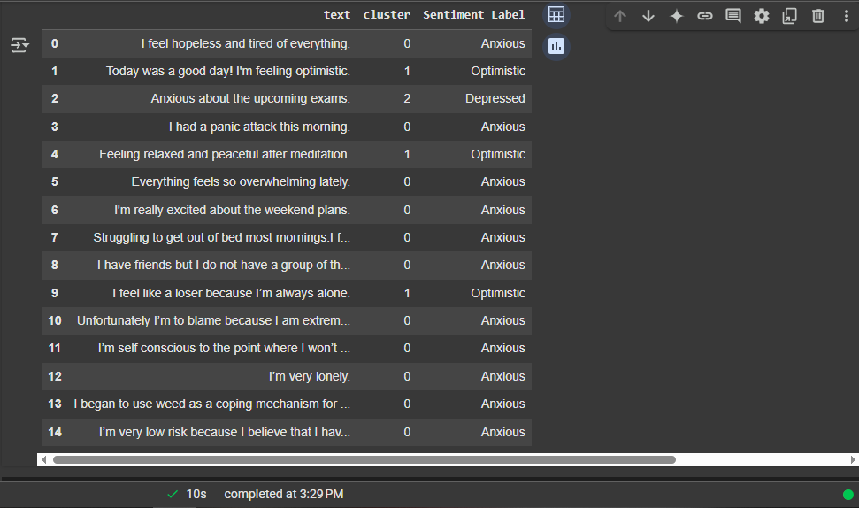
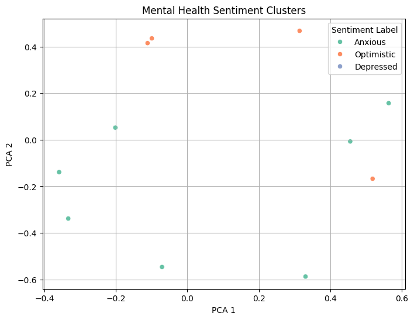

**Tags:** `NLP` • `Unsupervised Learning` • `Mental Health` • `KMeans` • `Sentiment Analysis` • `Dashboard` • `Python`

# 🧠 Mental Health Sentiment Analysis Dashboard
> Using Machine Learning to understand the unspoken.

A dashboard project that applies **Natural Language Processing** + **KMeans Clustering** to categorize mental health-related text into emotional tone clusters. It's part sentiment analysis, part real-world empathy — coded with care.

## 📌 Features

- Cleaned and preprocessed text using NLP techniques
- TF-IDF vectorization to extract features
- Unsupervised ML with KMeans for sentiment clustering
- Matplotlib & Seaborn for insightful data visualizations
- Interactive dashboard for real-time sentiment insights

## 🚀 Tech Stack & Environment
This project was developed using Google Colab — a cloud-based Jupyter environment that makes it easy to run and share notebooks without any setup. No installation required — just open and run!

⚙️ Built With:
🟣 Google Colab
🐍 Python 3.10
🧠 scikit-learn (for KMeans clustering)
🧾 Pandas (for data wrangling)
📊 Matplotlib & Seaborn (for visualizations)

▶️ Run it Yourself
Click below to open the notebook in Colab and try it out:
https://colab.research.google.com/drive/1b4F1DMDZnYvbRHZkWlojug6nvM3wWNbp?usp=sharing


## 📂 Project Structure

Mental-Health-Sentiment-Analysis/
├── sample dataset/                   # Dataset or input text files
├── notebooks/              # Jupyter notebooks for experimentation
├── src/                    # Core logic and modular scripts
│   ├── preprocessing.py
│   └── model.py
├── dashboard.py            # Dashboard code (Streamlit or CLI)
├── requirements.txt        # List of dependencies
└── README.md

## 📸 Screenshots




### 🧾 Input Sample


### 📊 Sentiment Clusters


### 📈 Dashboard UI


## 🛠️ Installation & Usage

1. Clone the repository:
```bash
git clone https://github.com/pawniityagii/Mental-Health-Sentiment-Analysis.git
cd Mental-Health-Sentiment-Analysis
````

2. Install the dependencies:

```bash
pip install -r requirements.txt
```

3. Run the dashboard or notebook:

```bash
python dashboard.py
# or
jupyter notebook notebooks/sentiment_analysis.ipynb
```

## 📊 Results & Insights

* **Cluster 0** → Anxious, overwhelmed tone
* **Cluster 1** → Positive/supportive messages
* **Cluster 2** → Depressive or emotionally withdrawn patterns

These clusters offer a stepping stone to building tools that understand emotional distress signals from text and enable proactive mental health analysis.

## 🧠 Future Enhancements

* Deploy live dashboard using Streamlit or Hugging Face Spaces
* Integrate VADER/TextBlob for polarity scoring
* Fine-tune model with social media datasets (Reddit, Twitter mental health threads)
* Add a feedback loop for retraining the model on real-world text


## 🙋 About Me

I'm a Computer Science undergrad passionate about the intersection of AI and mental health. I believe code can care — and this project is proof of concept.


📫 Let's connect:
[LinkedIn](https://linkedin.com/in/pawni-tyagi) • [Portfolio](https://pawnityagi.my.canva.site) • [GitHub](https://github.com/pawniityagii)


> 💬 If this repo helped or inspired you, leave a ⭐ — it makes my day!
